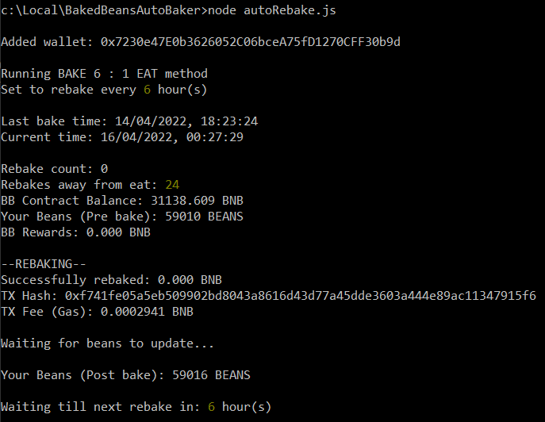
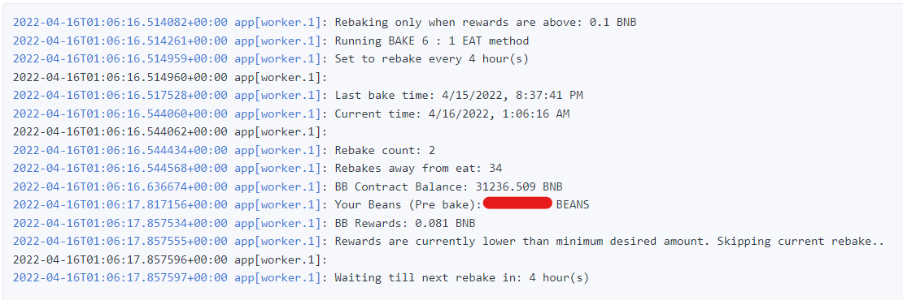
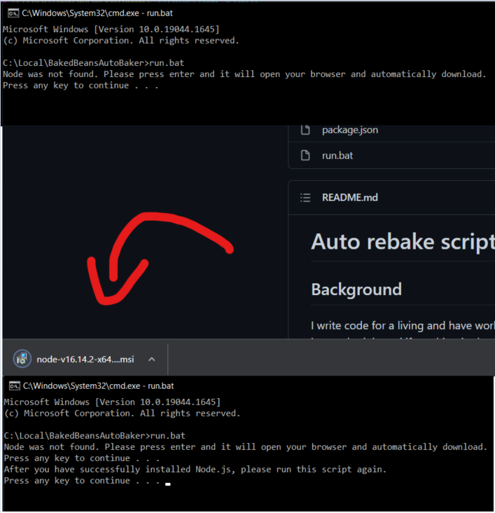
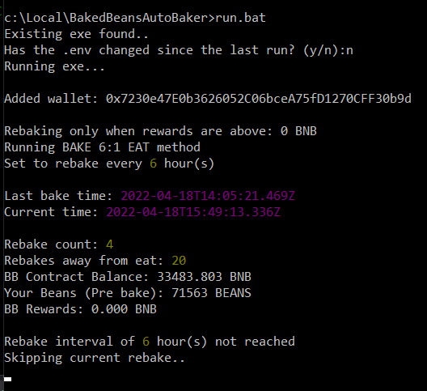
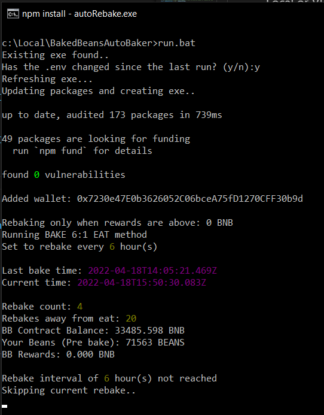

# Auto rebake script For BakedBeans miner on BSC

## Background

I write code for a living and have worked in the finance space for the past 4 years. I wrote this bot because I live a busy schedule and if anything in the tech world requires simple repetitive actions, it can always be automated. The baked beans project recommends to rebake (compound) every day for 6 days and then on the 7th you can "eat" to claim back rewards. 

This script has been written to automate that whole process with the ability to configure variables to tweak the scripts behaviour. For example, the default behaviour will rebake 4 times a day (REBAKES_PER_DAY) for 6 days (REBAKE_DAYS). After it's reached the required REBAKE_DAYS, it will enter "EAT DAY" and then wait 24 hours to eat (It does this to make sure we get the maximum reward from the day). It will then reset all the counters and restart the cycle. 

Even though this script is labelled BakedBeans miner, it can be trivially adapted to automate many other miner dApps and BakedBeans forks. This would require code changes and replacing the smart contract calls to the desired projects functions.

> Note: Make sure to have enough BNB in your wallet for gas fees as each rebake costs gas.

## Configurations

### Mandatory:
- `BSC_PRIVATE_KEY`
    - The private key for your wallet
- `REBAKES_PER_DAY` (default set to 4)
    - The number of times to rebake (compound) in 24 hours

### Optional:
- `REBAKE_DAYS` (default set to 6)
    - Rebakes for `n` days and eats on `n+1` (After a full 24 hours for maximum reward). If not set, the script will continue to rebake indefinitely. 
- `MIN_REWARD_AMOUNT_TO_REBAKE` (default set to 0.01)
    - Won't rebake if the current reward amount is lower than this value

> Note: It is necessary to add your wallets private key as this script works directly with the smart contract and would need to make transactions with your wallet i.e. rebaking and eating. This script is unlike other "auto" bots in that it doesn't require your browser to be open. 

You can find your wallets private key in MetaMask 

Account Options (3 dots) > Account Details > Export Private Key

## Running the script

### <ins>Local or VPS</ins>

### Setup

Clone/fork the repo and edit the `.env` file to add the mandatory and any optional configs. You can also just choose the Download ZIP option found under the Code button in GitHub. Extract the ZIP and then double click the `run.bat`

This batch script will check if the correct required .env configs are there, then it will check if you have [node](https://nodejs.org/en/) installed on your machine. If it's not installed, it will automatically download it by opening your browser. You'll need to complete the installation yourself and then once it's successfully done, double click or run the `run.bat` script again. That's all you need to do. See [below](#local-batch-file-use) for images of the batch file running.

> Note: Batch scripts only work on Windows. For Linux or Mac you'll need to run: `sudo apt update && sudo apt install node` and then run: `npm install && npm start` (after modifying the .env file).

The script will run fine this way but just note that the script will need to be running (obviously) in order for you to rebake/eat. There is local file persistence logic which holds the running counters of the script, meaning even if you restart it still has the needed metadata available.

<b>Persisted metadata</b>

|Metadata variables|Description|
|:-------------|:-----------------------------------------|
|"REBAKE_COUNT"|Running count of rebakes to know when it's time to EAT|
|"EAT_DAY_START_TIME"|Waits for 24 hours after this time to eat|
|"LAST_BAKE_TIME"| Waits for (24 / REBAKES_PER_DAY) hour(s) from this time to rebake again|

> Note: This is the same data persisted by redis when using the Heroku setup

### <ins>Deploy to Heroku - FREE</ins>

Prerequisite: 
- GitHub account
- Heroku account

This means you don't need to have the script running on your machine 24/7 as Heroku will host the script on their containers.

Steps: (Approx 10 minutes)
1. Create a new app on Heroku
2. Fork this repository to your own GitHub account
3. Connect your forked repo to Heroku (Choose GitHub under Deploy)
4. Add keys to config vars section (Found under Settings)
5. Add the `Redis To Go` add-on (Nano price plan - FREE)
6. Turn off the web dyno and turn on worker dyno

Explained:

You'll need to make an account on Heroku and create a new app. You can call this anything, mine is called `bakedbeans-autostake`. Then fork this repo and hook it up to Heroku, the deployment method is GitHub. I've included a heroku Procfile that selects the correct worker dyno. 

> Note: Make sure you are using the worker dyno and switch of the default web dyno otherwise it will pollute your logs with web dyno errors.

With the sensitivity of the data required by the script and since we're deploying it to Heroku, <b>don't add your values in the .env file</b>. In this case you'll need to add all mandatory and any optional keys to the [Config vars](https://devcenter.heroku.com/articles/config-vars) section in Heroku. Heroku encrypts this so it's safe to keep confidential data here. You don't need to delete the `.env`, Heroku will prioritise the values in it's config vars automatically.

#### <b>Redis To Go</b>

The way Heroku works, it recycles dynos every 24 hours, which obviously is not ideal as we need to keep track of how many rebakes we're up to etc. If the script is restarted, it loses the in memory count. To work around this, I've added redis support into the script, this is to persist the running counts outside of the script so that we still have them after restarts. All you need to do is enable the add-on in Heroku for [Redis To Go](https://elements.heroku.com/addons/redistogo) and choose the Nano price plan which is free. Once added it will automatically add a config var named `REDISTOGO_URL`. Now you're all set.

You can check the logs in Heroku to see if it's running correctly.

## Log outputs
### Local

### Heroku

## Local batch file use

### On first run it will check if node is installed, if not installed it will download it in the browser

### If node is detected it will automatically install packages, create the exe and run it.

### On subsequent runs where the exe exists, it ask if any changes have been made to the .env and if not, will proceed to run the exe.

### If changes have been made to the .env it will refresh the exe and create it again.

## Considerations

If you like this please consider using my referral link, I'd really appreciate it

https://bakedbeans.io/?ref=0xCb7DCb16e7738C01BEf5F74AC727dE2da44AfD6F

If you're feeling extra generous, send any tips here :) 

`0xCb7DCb16e7738C01BEf5F74AC727dE2da44AfD6F`

Disclaimer: Note this is unaudited code and is not production ready for financial transactions.
